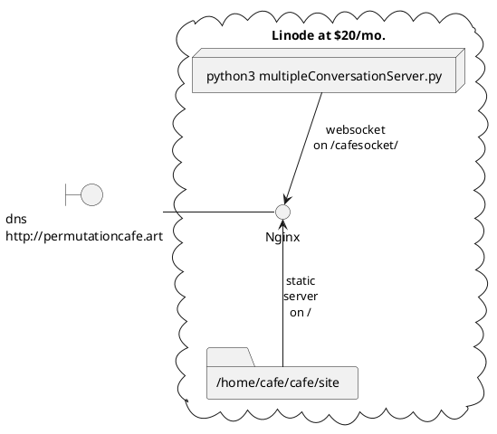
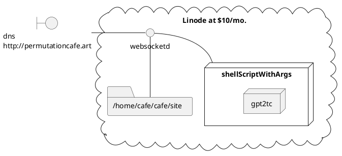

The bookModel model weights are available on request. They're enormous.

## PRIME THE PUMP FOR CURRENT MODEL

* Rename one of the books models from dialog-lankhmar-all-774M-1000.bin (for example) to gpt2_774M.bin
* Put dialog-lankhmar-all-774M-1000 (for example) into current774MModel.txt

## Deployment

Create Linode: shared CPU, 4GB RAM, 2CPU, 80GB storage.

SSH: root@ipaddr
adduser cafe
adduser cafe sudo
exit

scp -r gpt2tc cafe@ipaddr:/home/cafe/cafe/

SSH: cafe@ipaddr

cd cafe/gpt2tc
chmod -x gpt2tc
# Test!
./gpt2tc -m 774M -l 30 g 

scp requirements.txt cafe@ipaddr:/home/cafe/cafe/
scp multipleConversationServer.py cafe@ipaddr:/home/cafe/cafe/
ssh cafe@ipaddr

sudo apt update
sudo apt install python3-pip
cd cafe
pip3 install -r requirements.txt
# Open port 80, and preroute port 3000 from our servers through it
sudo iptables -I INPUT -p tcp -m tcp --dport 80 -j ACCEPT
python3 multipleConversationServer.py

# Get the website pages up
# on your host machine, build the site:
npm run build
# ... while in /site/ai-bookshop-cafe/
scp -r dist\ root@ipaddr:/home/cafe/cafe/site
# Then ssh in again, and run
sudo apt install nginx
sudo nano /etc/nginx/nginx.conf

# And add these blocks to http {}
map $http_upgrade $connection_upgrade {
    default upgrade;
    '' close;
}
server {
    listen 80;
    root /home/cafe/cafe/site;

    location / {
        audoindex on;
    }

    location /cafesocket/ {
        proxy_pass http://localhost:3001;
        proxy_http_version 1.1;
        proxy_set_header Upgrade $http_upgrade;
        proxy_set_header Connection $connection_upgrade;
        proxy_read_timeout 3600s;
    }

}

# Comment out the sites-enabled include above that
# And at the top of the file, change user www-data; to user cafe;

# Save, exit, and return to the ssh session:
sudo nginx -s reload

exit
scp -r site\ai-bookshop-cafe\dist root@ipaddr:/var/www/html

### Experiments: Deploying on smaller instances.

Nanode: 1CPU, 25GB storage, 1GB RAM: gpt2tc immediately killed.
resized
Linode: 1CPU, 50GB storage, 2GB RAM: gpt2tc loads, pretty much works yep

### JUNK

# Now setup static serving
sudo apt install apache2

sudo nano /etc/apache2/ports.conf
# THEN:
  GNU nano 4.8                                         /etc/apache2/ports.conf                                         Modified
# If you just change the port or add more ports here, you will likely also
# have to change the VirtualHost statement in
# /etc/apache2/sites-enabled/000-default.conf

Listen 3000

<IfModule ssl_module>
        Listen 3002
</IfModule>

<IfModule mod_gnutls.c>
        Listen 3002
</IfModule>

# vim: syntax=apache ts=4 sw=4 sts=4 sr noet
# END OF NANO EDITING HERE
# Save and exit nano
sudo nano /etc/apache2/sites-available/000-default.conf
# In here, set Document Root to /home/cafe/cafe/site.
# Repeat for default-ssl.conf
# Also nano edit /etc/apache2/apache2.conf and change line
# <Directory /var/www/>
# into
# <Directory /home/cafe/cafe/site/>
sudo service apache2 restart

# It didn't change the root folder. purged apache, started over again:

# Redid the port setup
# Redeployed website dist
sudo rm /var/www/html/*.*

